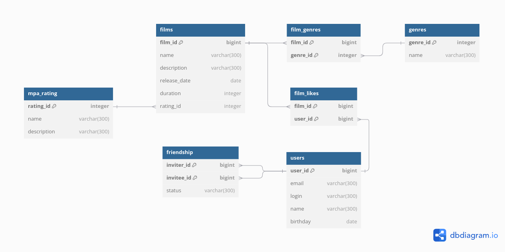

# java-filmorate
Template repository for Filmorate project.

### Схема базы данных проекта:



### Описание схемы базы данных проекта:

#### `films`

Таблица содержит информацию о каждом фильме и состоит из полей:

- `film_id` - идентификатор фильма (**первичный ключ**)
- `name` - название фильма
- `description` - описание фильма
- `release_date` - дата релиза фильма
- `duration` - продолжительность фильма
- `rating_id` - рейтинг Ассоциации кинокомпаний/идентификатор рейтинга для таблицы `mpa-rating`

#### `mpa-rating`

Таблица содержит информацию о возрастном ограничении для фильма и состоит из полей:

- `rating_id` - идентификатор рейтинга (**первичный ключ**)
- `name` - название рейтинга
- `description` - описание рейтинга

#### `genres`

Таблица содержит информацию о жанрах фильма и состоит из полей:

- `genre_id` - идентификатор жанра (**первичный ключ**)
- `name` - название жанра

#### `film-genres`

Таблица содержит информацию о жанрах (из таблицы `genres`) фильма (из таблицы `films`) и состоит из полей:

- `film_id` - идентификатор фильма (**первичный ключ составной**)
- `genre_id` - идентификатор жанра (**первичный ключ составной**)

#### `film-likes`

Таблица содержит информацию о лайке пользователя (из таблицы `users`) к фильму (из таблицы `films`) и состоит из полей:

- `film_id` - идентификатор фильма (**первичный ключ составной**)
- `user_id` - идентификатор пользователя (**первичный ключ составной**)

#### `users`

Таблица содержит информацию о каждом пользователе и состоит из полей:

- `user_id` - идентификатор пользователя (**первичный ключ**)
- `email` - электронная почта пользователя
- `login` - логин пользователя
- `name` - имя пользователя для отображения
- `birthday` - дата рождения пользователя

#### `friendship`

Таблица содержит информацию о дружбе пользователей (из таблицы `users`) и состоит из полей:

- `inviter_id` - идентификатор пользователя, отправляющего запрос на добавление в друзья (**первичный ключ составной**)
- `invitee_id` - идентификатор пользователя, получающего запрос на добавление в друзья (**первичный ключ составной**)
- `status` - статус запроса (confirmed/not confirmed)

### Примеры запросов к базе данных для основных операций приложения:

- Получение списка всех пользователей:
```sql
SELECT * FROM users;
```
- Добавление нового пользователя:
```sql
INSERT INTO users (email, login, name, birthday)
VALUES ('mail@yandex.ru', 'user', 'Иванов', '1900-01-01');
```
- Получение списка друзей пользователя с id = 1:
```sql
SELECT u.login FROM users AS u
WHERE u.user_id = (SELECT invitee_id FROM friendship
WHERE inviter_id = 1
AND status = 'confirmed');
```
- Удаление пользователя с id = 1:
```sql
DELETE FROM users
WHERE user_id = 1;
```
- Получение 10 самых популярных фильмов:
```sql
SELECT f.name FROM films AS f
WHERE f.film_id = (SELECT film_id FROM film_likes  
GROUP BY film_id
ORDER BY COUNT(user_id) DESC
LIMIT 10);
```